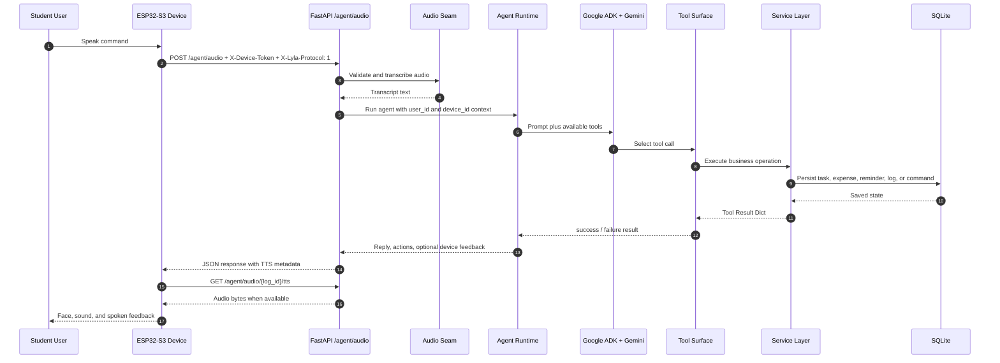

# Architecture Flow Diagram — Generation Prompt

Gunakan file ini sebagai prompt untuk membuat gambar diagram alir arsitektur
sistem Lyla / Taskbot secara general. Output utama yang diharapkan adalah
diagram arsitektur logis, bukan diagram deployment cloud yang terlalu detail.

## 1. Diagram scope

Buat diagram arsitektur umum untuk proyek Lyla / Taskbot: asisten tugas
Bahasa Indonesia untuk pelajar yang menerima perintah teks/suara, memprosesnya
di backend FastAPI + Google ADK/Gemini, menyimpan data di SQLite, menampilkan
data lewat dashboard web React, dan memberi feedback ke perangkat ESP32-S3.

Fokus pada komponen yang sudah menjadi bagian desain sistem saat ini:

- ESP32-S3 sebagai local interaction controller.
- Frontend dashboard sebagai thin client.
- FastAPI backend sebagai pusat API, business logic, data persistence, auth,
  observability, audio pipeline, scheduler, dan agent runtime.
- Google ADK + Gemini sebagai orchestration layer untuk tool calling.
- SQLite sebagai database MVP.
- Device command queue untuk feedback dari backend ke ESP32-S3.

Jangan menggambar layanan spekulatif, detail reasoning internal model AI, atau
arsitektur multi-tenant yang belum menjadi scope sistem.

## 2. Recommended output formats

Hasilkan tiga output:

1. Mermaid `flowchart LR` untuk diagram arsitektur general.
2. Mermaid `sequenceDiagram` untuk flow suara end-to-end.
3. Satu prompt visual pendek untuk image generator bila ingin dibuat sebagai
   poster/hero diagram.

## 3. Actors and external systems

| Actor / System | Role in diagram |
|---|---|
| Student User | Memberi perintah teks atau suara dalam Bahasa Indonesia. |
| Operator | Login dashboard, pair device, dan menyalin `config_json` ke SD card. |
| ESP32-S3 Device | Local controller: OLED face, tombol/trigger, audio recording, speaker/buzzer, heartbeat, dan polling command. |
| Frontend Dashboard | Vite + React + TypeScript + Tailwind SPA; thin client yang memanggil FastAPI langsung. |
| FastAPI Backend | Pusat API, auth, agent runtime, tools, services, audio, scheduler, observability, dan persistence. |
| Google ADK + Gemini | Runtime AI untuk orchestration dan tool calling. |
| SQLite Database | Database MVP untuk user, devices, tasks, expenses, reminders, logs, sessions, dan device commands. |
| APScheduler / Reminder Tick | Background tick yang memproses reminder dan dapat membuat command untuk device. |

## 4. Components and repo paths

Gambar komponen backend sebagai layered architecture. Label box dengan nama
komponen dan path repository jika relevan.

| Diagram box | Repo path | Responsibility |
|---|---|---|
| ESP32-S3 Firmware | `firmware/` | Boot from SD config, connect WiFi, send audio, poll commands, render face/audio feedback. |
| Frontend SPA | `frontend/` | Dashboard pages, login, observability, device pairing UI, API calls. |
| FastAPI HTTP Layer | `app/api/` | `/agent/*`, `/dashboard/*`, `/devices/*`, `/auth/*`, `/observability/*`. |
| Agent Runtime | `app/agent/` | Fake/real agent selection, ADK event handling, per-request tool factory. |
| Tool Surface | `app/tools/` | Stable tool result wrappers; tools never raise. |
| Services | `app/services/` | Business logic and typed domain errors. |
| Models | `app/models/` | SQLAlchemy ORM models. |
| Audio Seam | `app/audio/` | STT/TTS provider seam, fake and real provider modes. |
| Scheduler | `app/scheduler/` | Reminder tick and lifecycle. |
| Dev ADK Agent | `agents/taskbot_agent/` | ADK Web CLI prompt iteration only; not production traffic. |
| Scripts | `scripts/` | Seed, CLI smoke, password hash, local operations. |
| Docs / Specs | `docs/`, `.kiro/specs/` | Architecture decisions, contracts, phase summaries, normative specs. |

## 5. Main flows to draw

Draw these six labeled flows. Use numbered edge labels so readers can follow
the path without reading source code.

### Flow A — Device pairing and SD-card provisioning

1. Operator opens Frontend Dashboard and logs in with dashboard session cookie.
2. Operator uses Devices page to call `POST /devices/pair`.
3. FastAPI creates or pairs a `Device` row and returns ready-to-paste
   `config_json`.
4. Operator fills WiFi fields and saves the config as `/sd/config.json` on the
   microSD card.
5. ESP32-S3 boots, reads `user_id`, `device_id`, `device_code`, `device_token`,
   `base_url`, WiFi credentials, and `firmware_version`.

### Flow B — Text command from dashboard

1. Student User types a command in the dashboard command box.
2. Frontend sends `POST /agent/text` to FastAPI.
3. FastAPI builds a per-request tool factory with `db`, `user_id`, and
   `device_id` injected through closures.
4. Google ADK + Gemini chooses one or more tools.
5. Tool wrappers call service layer.
6. Service layer persists state in SQLite.
7. FastAPI returns reply, actions, and optional device feedback to Frontend.

### Flow C — Voice command from ESP32-S3

1. ESP32-S3 records audio locally.
2. ESP32-S3 sends multipart `POST /agent/audio` to FastAPI with
   `X-Device-Token` and `X-Lyla-Protocol: 1`.
3. FastAPI validates auth, upload size/type, and telemetry fields.
4. Audio Seam transcribes speech to text.
5. FastAPI runs the same agent runtime used by `POST /agent/text`.
6. Google ADK + Gemini calls tools through the per-request tool factory.
7. Services write tasks, expenses, reminders, logs, or device commands into
   SQLite.
8. Audio Seam prepares TTS metadata/cache.
9. FastAPI returns JSON response with reply, actions, directive metadata, and
   TTS availability.
10. ESP32-S3 fetches `GET /agent/audio/{log_id}/tts` when TTS audio is
    available, then plays feedback through speaker/buzzer.

### Flow D — Dashboard read/write flows

1. Frontend Dashboard calls `/dashboard/*` endpoints for Ringkasan, Tugas,
   Pengeluaran, Riwayat, and Devices pages.
2. FastAPI validates dashboard auth/session policy.
3. API handlers call service layer.
4. Services query SQLite.
5. Frontend renders stat cards, task lists, expense forms, voice logs, device
   status, and observability views.

### Flow E — Device command polling lifecycle

1. Backend creates `device_commands` rows when tools or scheduler request
   feedback, especially through `send_device_command`.
2. ESP32-S3 polls `GET /devices/{device_code}/commands/pending` with
   `X-Device-Token`.
3. FastAPI returns pending command payloads such as face, sound, or text.
4. ESP32-S3 executes the command locally.
5. ESP32-S3 sends `POST /devices/{device_code}/commands/{command_id}/ack`.
6. FastAPI marks the command as delivered/acknowledged in SQLite.

### Flow F — Reminder scheduler tick

1. APScheduler triggers reminder tick on an interval.
2. Scheduler calls reminder logic in-process, not through HTTP.
3. Service layer finds due reminders in SQLite.
4. Backend may enqueue device command feedback for the ESP32-S3.
5. ESP32-S3 receives that feedback through the command polling lifecycle.

## 6. Endpoint labels to include

Include these exact endpoint labels in the diagram where relevant:

- `POST /auth/login`
- `POST /auth/logout`
- `GET /auth/me`
- `POST /agent/text`
- `POST /agent/audio`
- `GET /agent/audio/{log_id}/tts`
- `POST /devices/pair`
- `POST /devices/{device_code}/status`
- `GET /devices/{device_code}/commands/pending`
- `POST /devices/{device_code}/commands/{command_id}/ack`
- `/dashboard/*`
- `/observability/*`

Annotate device-side endpoints with `X-Device-Token`. Annotate firmware protocol
traffic with `X-Lyla-Protocol: 1`.

## 7. Agent tool surface

Draw the tool surface as one subgraph labeled `Tool Surface (per-request tool
factory)`. Inside it include exactly these tools:

- `create_task`
- `create_expense`
- `set_reminder`
- `get_today_summary`
- `send_device_command`

Add this note near the subgraph: `db`, `user_id`, and `device_id` are injected
server-side; the LLM only sees business parameters.

## 8. Data stores and important records

Draw SQLite as one persistence node, then list key logical tables/entities inside
or beside it:

- `users`
- `devices`
- `tasks`
- `expenses`
- `reminders`
- `voice_command_logs`
- `device_commands`
- dashboard sessions / auth state

If showing migrations, draw them as offline maintenance path from `alembic/` to
SQLite. Do not turn migrations into a runtime request flow.

## 9. Boundaries and exclusions

Keep the diagram general and logical:

- Do not draw model-internal chain-of-thought or hidden reasoning.
- Do not draw unimplemented future notification providers.
- Do not draw generic ESP frameworks that this MVP intentionally does not use.
- Do not draw cloud vendor internals unless making a separate deployment
  diagram.
- Do not draw a backend-for-frontend layer; the browser talks to FastAPI
  directly.
- Do not draw PostgreSQL as current state; SQLite is current MVP persistence,
  with possible migration path only as a small future note.

## 10. Visual style guidance

Use a clean left-to-right layout:

- Left: Student User, Operator, Frontend Dashboard, ESP32-S3 Device.
- Center: FastAPI Backend grouped into HTTP Layer, Agent Runtime, Tool Surface,
  Services, Audio Seam, Scheduler, and Observability.
- Right: SQLite Database and Google ADK + Gemini external dependency.
- Use solid arrows for synchronous request/response.
- Use dashed arrows for polling, scheduler ticks, and offline SD-card transfer.
- Use distinct colors or subgraphs for Client, Backend, AI Runtime, Persistence,
  and Device Runtime.
- Keep labels short, but include exact endpoint names on critical arrows.

## 11. Starter Mermaid flowchart

Use this as a starter. Extend it until all flows in section 5 are represented.

```mermaid
flowchart LR
  Student[Student User]
  Operator[Operator]
  ESP[ESP32-S3 Device\nfirmware/]
  SPA[Frontend Dashboard\nfrontend/]
  Gemini[Google ADK + Gemini]
  DB[(SQLite Database)]
  Scheduler[APScheduler\napp/scheduler/]

  subgraph Backend[FastAPI Backend]
    API[HTTP API Layer\napp/api/]
    Agent[Agent Runtime\napp/agent/]
    Tools[Tool Surface\nper-request tool factory]
    Services[Service Layer\napp/services/]
    Audio[Audio Seam\napp/audio/]
    Observability[Observability\n/observability/*]
  end

  subgraph ToolSurface[Five Agent Tools]
    T1[create_task]
    T2[create_expense]
    T3[set_reminder]
    T4[get_today_summary]
    T5[send_device_command]
  end

  Operator -. saves config .-> ESP
  Operator -->|POST /auth/login| SPA
  SPA -->|POST /devices/pair| API
  Student --> SPA
  SPA -->|POST /agent/text| API
  ESP -->|POST /agent/audio\nX-Device-Token\nX-Lyla-Protocol: 1| API
  ESP -.->|GET /devices/{device_code}/commands/pending\nX-Device-Token| API
  ESP -->|POST /devices/{device_code}/status\nX-Device-Token| API
  API --> Agent
  API --> Audio
  Agent --> Gemini
  Agent --> Tools
  Tools --> ToolSurface
  ToolSurface --> Services
  Services --> DB
  Scheduler -. reminder_tick .-> Services
  Services -. enqueue command .-> DB
  SPA -->|/dashboard/*| API
  SPA -->|/observability/*| Observability
  API -->|GET /agent/audio/{log_id}/tts| Audio
```

## 12. Starter Mermaid sequence diagram for voice flow



## 13. Image-generation prompt

Create a clean technical architecture diagram poster for "Lyla / Taskbot", an
Indonesian student assistant. Show a left-to-right system flow: student and
operator on the left, React dashboard and ESP32-S3 device clients, FastAPI
backend in the center with API layer, agent runtime, five tools, services,
audio seam, scheduler, auth and observability, then SQLite persistence and
Google ADK + Gemini on the right. Use modern flat vector style, clear grouped
boxes, readable endpoint labels, blue and teal accent colors, and no clutter.
The diagram should feel like a professional software architecture overview.

## 14. Verification checklist for the generated diagram

Before accepting the generated diagram, verify that it includes:

- ESP32-S3 Device.
- Frontend Dashboard / Vite React SPA.
- FastAPI Backend.
- Google ADK + Gemini.
- SQLite Database.
- APScheduler or reminder tick.
- `POST /agent/text`.
- `POST /agent/audio`.
- `GET /agent/audio/{log_id}/tts`.
- `POST /devices/pair`.
- `GET /devices/{device_code}/commands/pending`.
- `POST /devices/{device_code}/commands/{command_id}/ack`.
- `X-Device-Token`.
- `X-Lyla-Protocol: 1`.
- `/sd/config.json`.
- `per-request tool factory`.
- `create_task`.
- `create_expense`.
- `set_reminder`.
- `get_today_summary`.
- `send_device_command`.

Also verify that the diagram does not imply unsupported future services,
AI-model internals, or a backend-for-frontend layer.
